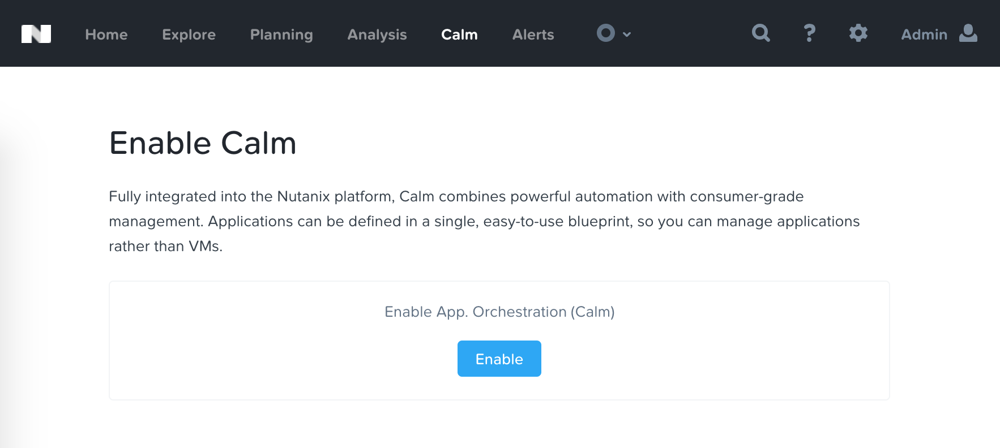
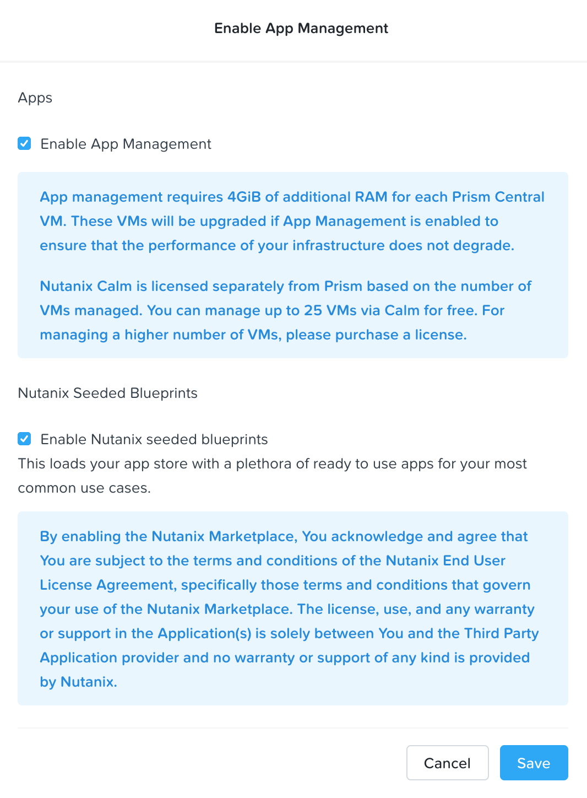
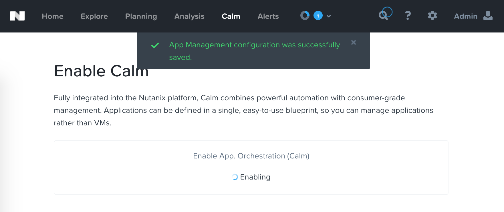
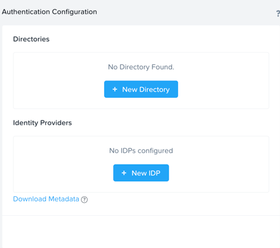
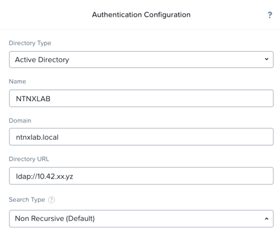
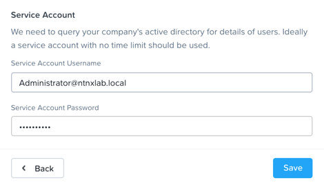
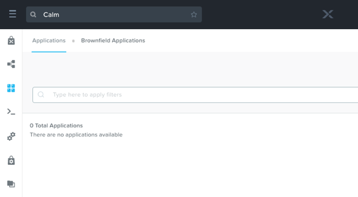
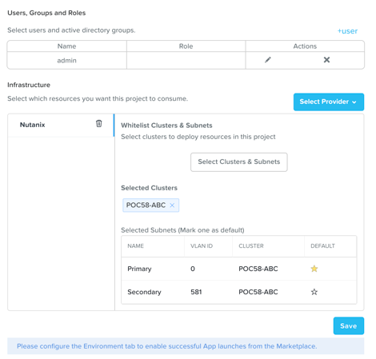

.. _calm_enable:

---------------------------------
Enable and Create Projects
---------------------------------

Overview
++++++++

  Estimated time to complete: **10 MINUTES**

  In this exercise you will enable Calm from Prism Central configure AD and create a Project to contain your Blueprints and Applications created throughout the Workshop.

Enabling App Management
+++++++++++++++++++++++

Open \https://*<Prism-Central-IP>*:9440/ in a browser and log in.

From the navigation bar, select **Service > Calm** 

Click **Enable**.

Select **Enable App Management** and click **Save**.

.. note:: Nutanix Calm is a separately licensed product that can be used with Acropolis Starter, Pro, or Ultimate editions. Each Prism Central instance can manage up to 25 VMs for free before additional licensing is required.

You should get verification that Calm is enabling, which will take 5 to 10 minutes.

Adding Active Directory
+++++++++++++++++++++++

This lab requires `AD Deployment`_. 

.. _AD Deployment: https://bootcamps.nutanix.handsonworkshops.com/workshops/503dd651-8ffc-494c-9d7a-881929ce95ae/view/AD/AD/

If you have not yet deployed the VM, see the linked steps before proceeding with the lab.

While we're waiting for Calm to enable, we'll add an Active Directory server.  While this isn't required for basic Calm use, it is required to do any Role Based Access Control, so it's a good idea to get set up.

Click the **Gear Icon** and then click **Authentication**.

In the pop up, click **New Directory**.

Fill out the following fields and click **Save**:

- **Directory Type** - Active Directory
- **Name** - NTNXLAB
- **Domain** - ntnxlab.local
- **Directory URL** - ldap://*<DC-VM-IP>* 10.42.xx.yz
- **Username** - Administrator@ntnxlab.local
- **Password** - nutanix/4u

Refresh the browser and select **Calm** from the navigation bar.  If Calm is still enabling, wait another minute, and try again.

Creating A Project
++++++++++++++++++

Projects are the logical construct that integrate Calm with Nutanix's native Self-Service Portal (SSP) capabilities, allowing an administrator to assign both infrastructure resources and the roles/permissions of Active Directory users/groups to specific Blueprints and Applications.

Click **default** in the project list

.. figure:: images/581enable8.png

Under **Infrastructure**, fill out the following fields and click **comfirm** :
- **Select which resources you want this project to consume** - Nutanix
- **AHV Cluster** - *<POCxx-ABC>*
- Under **Network**, select the **Primary** and if available, the **Secondary** networks. 

Select :fa:`star` for the **Primary** network to make it the default virtual network for VMs in the **default** project.

Click **Save**.

Takeaways
+++++++++

- Nutanix Calm is a fully integrated component of the Nutanix stack. Easily enabled, highly available out of the box in a Scale Out Prism Central deployment, and takes advantage of non-disruptive One Click upgrades for new features and fixes.
- By using different projects assigned to different clusters and users, administrators can ensure that workloads are deployed the right way each time.  For example, a developer can be a Project Admin for a dev/test project, so they have full control to deploy to their development clusters or to a cloud, while having Read Only access to production projects, allowing them access to logs but no ability to alter production workloads.

