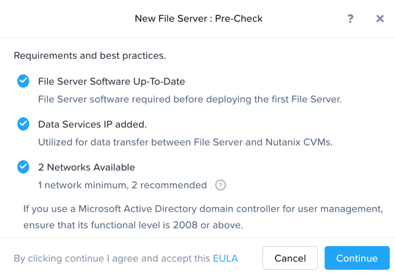
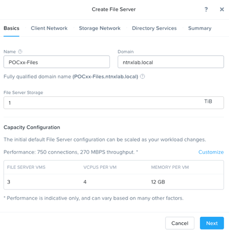
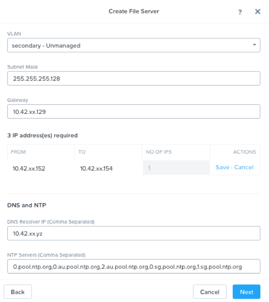
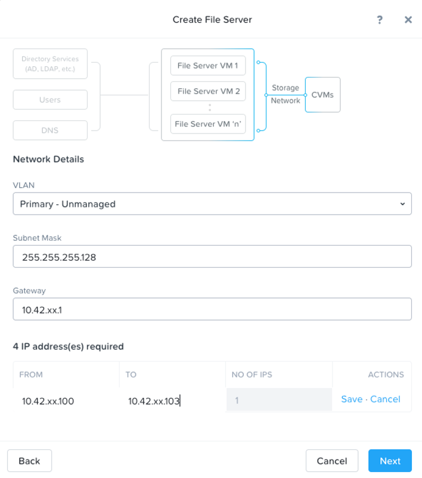
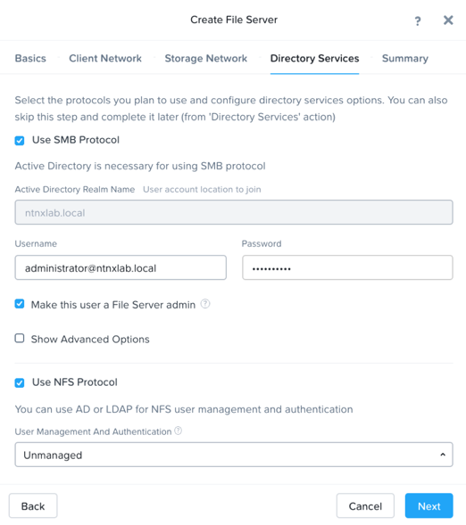
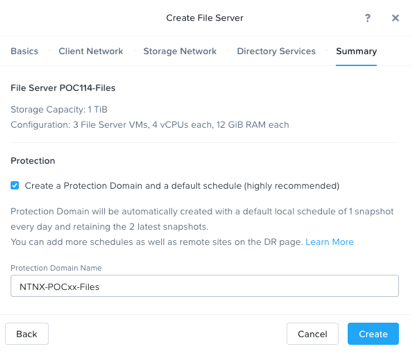
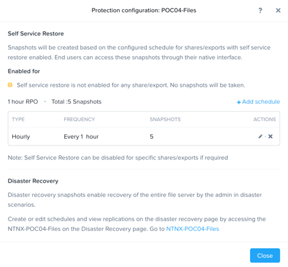

.. _files_deploy:

---------------
 Deploy File Services
---------------

Overview
++++++++

.. note::

  Estimated time to complete: **45 mins**

Traditionally, file storage has been yet another silo within IT, introducing unnecessary complexity and suffering from the same issues of scale and lack of continuous innovation seen in SAN storage. Nutanix believes there is no room for silos in the Enterprise Cloud. By approaching file storage as an app, running in software on top of a proven HCI core, Nutanix Files delivers high performance, scalability, and rapid innovation through One Click management.

In this lab you will use Prism to deploy Files, a native, distributed file server solution for Nutanix clusters. You will configure SMB share, and familiarize yourself with new features of the AFS offering.

Lab Setup
++++++++

This lab requires applications provisioned as part of the `Windows Tools VM`_ and `AD Deployment`_. 

.. _Windows Tools VM: https://bootcamps.nutanix.handsonworkshops.com/workshops/503dd651-8ffc-494c-9d7a-881929ce95ae/view/tools_vms/windows_tools_vm/#

.. _AD Deployment: https://bootcamps.nutanix.handsonworkshops.com/workshops/503dd651-8ffc-494c-9d7a-881929ce95ae/view/AD/AD/

You can use the Windows 10 VM launched from blueprint early in Calm lab. If you have not yet deployed these VMs, see the linked steps before proceeding with the lab.

Deploy Acropolis File Services
++++++++++++++++++++++++++++++

Open \https://*<POCxx-ABC Cluster IP>*:9440 (\https://10.42.xx.37:9440) in your browser and log in with the following credentials:

- **Username** - admin
- **Password** - techX2020!

In **Prism > File Server**, click **+ File Server**.

Firstly, download Files 3.5.1 package, click **Continue** to install File Services Software on POCxx.
Secondly, add Data Services IP as 10.42.xx.38. Click Continue.

Fill out the following fields and click **Next**:

- **Name** - *POCxx*-Files 
- **Domain** - ntnxlab.local
- **File Server Size** - 1 TiB
  
  

Select the **Secondary - UnManaged** VLAN for the Client Network. Specify your cluster's **AD** VM IP as the **DNS Resolver IP**. Click **Next**.

.. note::

  In order for the Files cluster to successfully find and join the **ntnxlab.local** domain it is critical that the **DNS Resolver IP** is set to the **AD** VM IP **FOR YOUR CLUSTER**. By default, this field is set to the primary **Name Server** IP configured for the Nutanix cluster, **this value is incorrect and will not work**.

Fill out the following fields and click **Next**:

- **Subnet Mask** – 255.255.255.128
- **Gateway** – 10.42.xx.129
- **IP** – **from** 10.42.xx.152 **to** 10.42.xx.154 (click **save** on the right)
- **DNS** – 10.42.xx.yz (AD VM IP address)
- **NTP** – 0.pool.ntp.org,0.au.pool.ntp.org,2.au.pool.ntp.org,0.sg.pool.ntp.org,1.sg.pool.ntp.org

.. note::

 Files requires n (n, being the number of FSVMs) IP addresses on the Client network: 1 IP address per FSVM.

Select the **Primary** VLAN for the Storage Network. Click **Next**.

Fill out the following fields and click **Next**:

- **Subnet Mask** – 255.255.255.128
- **Gateway** – 10.42.xx.1
- **IP** – **from** 10.42.xx.100 **to** 10.42.xx.103 (click **save** on the right)

.. note::
  
  AFS requires n+1 (n, being the number of FSVMs) IP addresses on the Storage network: 1 IP address per FSVM and 1 IP address for the CVMs to reach the FSVM cluster. This additional IP address is a floating highly available IP address. These IP addresses should not overlap with the IP addresses on the Client network.
  It is typically desirable to deploy Files with dedicated networks for client and storage. By design, however, Files does not allow client connections from the storage network in this configuration.

Fill out the following fields and click **Next**:

- Select **Use SMB Protocol**
- **Username** - Administrator@ntnxlab.local
- **Password** - See AD information from the console
- Select **Make this user a File Server admin**
- Select **Use NFS Protocol**
- **User Management and Authentication** - Unmanaged

Fill out the following fields and click **Create**:

- Select **Create a Protection Domain and a default schedule (highly recommended)**
- **PROTECTION DOMAIN NAME** - NTNX-POCxx-Files

Monitor deployment progress in **Prism > Tasks**.

Upon completion, select the *POCxx*-Files in **File Server** page and click **Protect**. Click **+Add schedule** to make a snapshot schedule you plan.

.. note::

  If you receive a warning regarding DNS record validation failure, this can be safely ignored. The shared cluster does not use the same DNS servers as your Files cluster, and as a result is unable to resolve the DNS entries created when deploying Files. We will use FSVM IP to access the File service from test Windows VM

Observe the default Self Service Restore schedules, this feature controls the snapshot schedule functionality. Supporting Previous Versions allows end users to roll back changes to files without engaging storage or backup administrators. Note these local snapshots do not protect the file server cluster from local failures and that replication of the entire file server cluster can be performed to remote Nutanix clusters. Click **Close**.

