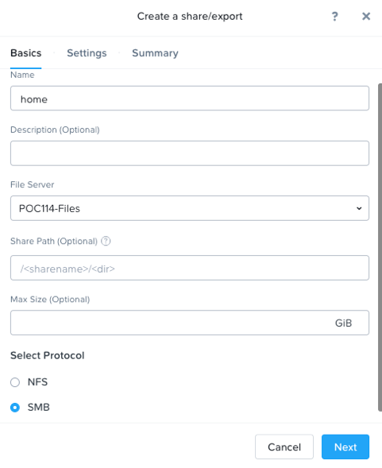
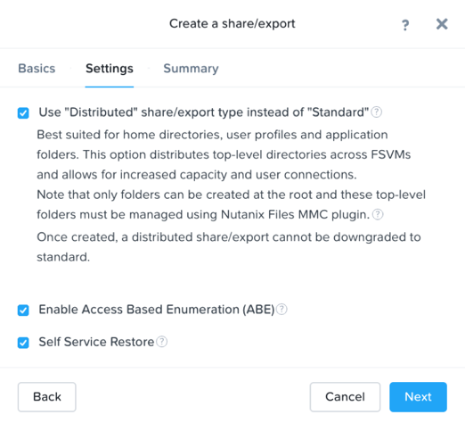
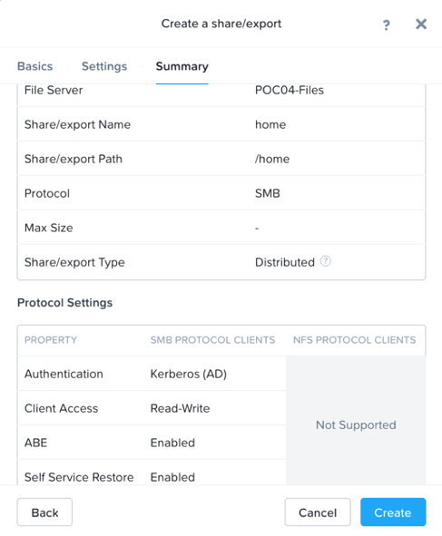
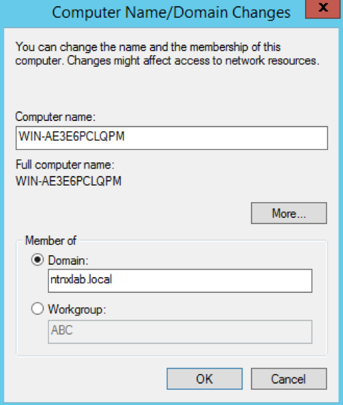

.. _files_share_SMB:

---------------
 Configuring SMB Home Share
---------------

Overview
++++++++

.. note::

  Estimated time to complete: **15mins**

In this exercise you will configure SMB share, and familiarize yourself with new features of the AFS offering.

Configuring SMB Home Share
+++++++++++++++++++++++++++

In **Prism** > **File Server**, click **+Share/Export**. 

Fill out the following fields and click Next:
- **Name** – home
- **File Server**- POCxx-Files
- **Select Protocol** - SMB
 
 

Select **Enable Access Based Enumeration (ABE)**, **Self Service Restore** and **Advanced Settings**. Select **Home directory and User Profiles** and click **next**

Review Summary tab and click **create**
 
 

Login to your **Windows tool VM** , add domain *ntnxlab.local*, restart this windows VM and login in with AD administrator credentials, test the avaiability of the share you created. If home share \\\\10.42.xx.152\\home is avaiable, create a new folder named **marketing** under home share.

.. image:: images/image023.png

