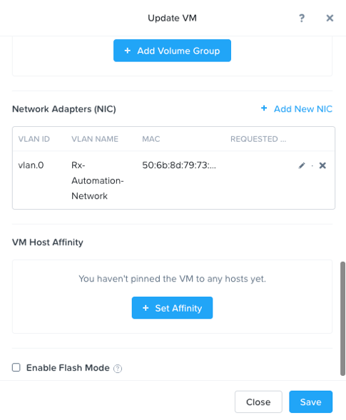

.. _volumes:

-----------------------
Volumes
-----------------------

Overview
++++++++

.. note::

  Estimated time to complete: **30 Minutes**

The Nutanix Volumes feature (previously know as Acropolis Volumes) exposes back-end DSF storage to external consumers (guest OS, physical hosts, containers, etc.) via iSCSI.

This allows any operating system to access DSF and leverage its storage capabilities.  In this deployment scenario, the OS is talking directly to Nutanix bypassing any hypervisor. 

Core use-cases for Acropolis Volumes:

Shared Disks
Oracle RAC, Microsoft Failover Clustering, etc.
Disks as first-class entities
Where execution contexts are ephemeral and data is critical
Containers, OpenStack, etc.
Guest-initiated iSCSI
Bare-metal consumers
Exchange on vSphere (for Microsoft Support)

Qualified Operating Systems
............................
The solution is iSCSI spec compliant, the qualified operating systems are just those of which have been validated by QA.

Microsoft Windows Server 2008 R2, 2012 R2
Redhat Enterprise Linux 6.0+

  
Configure Acropolis Block Services
++++++++++++++++++++++

Open \https://*<POCxx-ABC Cluster IP>*:9440 (\https://10.42.xx.37:9440) in your browser and log in with the following credentials:

- **Username** - admin
- **Password** - techX2019!
  
Create Cluster External Data Services IP: Click the Cluster name in the upper left hand corner to access the Cluster Details 
，enter the Cluster External Data Services IP Address (10.42.xx.38) in your Assigned Cluster Details. Close Cluster Details and proceed to Configure Guests.

.. figure:: images/1.png

Enable and Configure ABS in Prism for Windows
+++++++++++++++++++++++++++++++++++

Ensure that the *initials*-Windows_VM has access to the Network:
Login to Prism, navigate to the VM Dashboard, Table View, select *initials*-Windows_VM, and click Update, ensure that the VM has a NIC added, if it does not, add one now and attach it to VLAN0.

 
Save the VM Settings and continue to the next steps.

Login to the Windows Server guest VM to get the iSCSI iqn name:

Login to *initials*-Windows_VM on your assigned cluster with username “administrator” and your password. Click in the upper right hand corner of the desktop for the search window to appear.  It looks like a looking glass.  Click the Search icon.  Enter iscsi and “iscsi” and it will resolve to “iSCSI Initiator.” Start the Windows iSCSI service.

.. figure:: images/3.png
 

Click the “Configuration” tab to find the iqn.  Make a note of it for a later step.
 
.. figure:: images/4.png

Create a Volume Group in Prism:
Go back to Prism UI, navigate to the Storage Dashboard, click “+ Volume Group” to create a new Volume Group, in the Volume Group Window give the volume group a name "mywindowsvg", add a new disk and select default container, input a size for the disk of 60 and click Add.

9.  Click Save.

 

Connect ABS disks to Windows VM:
................................

Click the VG again and find the volume group we previously created.  Click on our windows VG and click Update. Under Access Control check the box and add the iqn previously recorded.

Switch back to your windows VM.  In the console of your windows VM in the iSCSI initiator properties click on the Targets tab.  Type in the data services ip and click Quick Connect.  You will see the target volume group we previously created.

 .. figure:: images/7.png

Click Done.
Open diskmgmt.msc from the Search menu and see the raw disk we added.  Optionally, click the disk to format and choose drive letter.

 .. figure:: images/8.png

Clone Volume Group and Attach to new VM
++++++++++++++++++++++++++++++++++++++++

1.  Navigate to VM Dashboard
2.  Select the Windows VM and Click Update
3.  Scroll Down and Make note of the Disks currently attached to VM
4.  Navigate to the Storage Dashboard
5.  Select your Volume Group for Windows and Click Clone

.. figure:: images/20.png

 
6.  Rename the Clone

.. figure:: images/21.png

 
7.  Click Save

8.  Select Volume Group and Click Update

 
9.  Attach the Volume Group Clone to the Windows VM

.. figure:: images/23.png

 
10. Select Windows from the Drop down list and click the Attach button

11. Note that Volume Group has been attached to the Windows VM

.. figure:: images/25.png

 
12. Click Close
13. Navigate back to VM Dashboard, Select Windows Server VM and click Update
14. Note that the VM now has an additional SCSI Disk attached
15. Test the new iscsi disk from your Windows VM

 .. figure:: images/27.png

 

